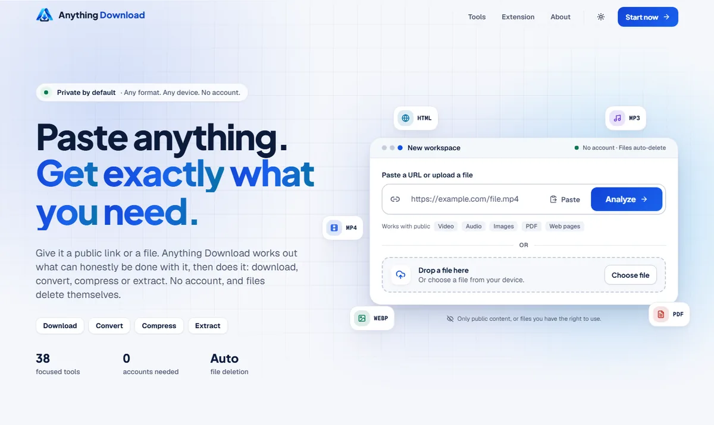
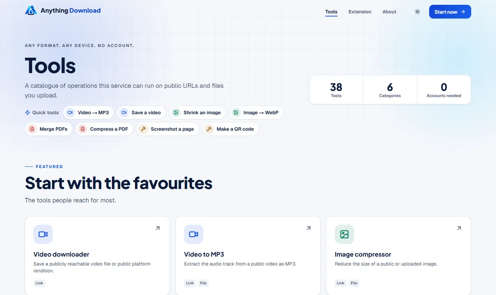
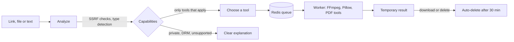

<div align="center">


# Anything Download

**Paste anything. Get exactly what you need.**

A privacy-first, open-source workspace for downloading, converting, compressing and
extracting publicly accessible media and files. No ads. No account. Files delete themselves.

[](https://github.com/sandeepbollavaram/anything-download/actions/workflows/ci.yml)
[](LICENSE)


[](CONTRIBUTING.md)

[Features](#features) · [Quick start](#quick-start) · [Architecture](#architecture) ·
[Security](#security-and-responsible-use) · [Roadmap](docs/roadmap.md) ·
[Contributing](#contributing)

</div>

<picture>
  <source media="(prefers-color-scheme: dark)" srcset="docs/assets/screenshot-home-dark.webp" />
  
</picture>

> **Status: release candidate.** CI is green on `main`. The public site at
> [anythingdownload.in](https://anythingdownload.in) is **not live yet**; staging comes
> first. Run it yourself today with Docker (two commands below).

---

## Why Anything Download

Most "download anything" sites are covered in ads, ask for accounts, keep your files, and
pretend every link works. Anything Download takes the opposite approach:

- **Honest.** The server inspects each link and offers only the tools that genuinely work
  for it. Private, protected or unsupported content gets a clear explanation, never a fake
  download button.
- **Private.** No account, no tracking scripts, no analytics, no ads. Logs never keep full
  links. Uploads and results are deleted automatically after 30 minutes, or immediately
  when you choose.
- **Safe by design.** Every URL is untrusted input: private and internal network
  addresses are blocked (including redirects and DNS rebinding), and every request, upload,
  process and output is size-, time- and rate-limited.
- **Open.** MIT licensed, self-hostable, and tested end to end in CI.

## Features

**38 focused tools in six categories**, all behind one input: paste a link, drop a file, or
type text.

| Category | Tools |
| --- | --- |
| **Video** (8) | Video downloader, Video to MP3, Video to WAV, Video to MP4, Video compressor, Video to GIF, Video thumbnail, Video metadata |
| **Audio** (4) | Audio downloader, Audio converter, Audio compressor, Audio metadata |
| **Image** (6) | Image downloader, Image compressor, Image converter, Image resizer, Image to WebP, Image to PDF |
| **PDF** (7) | PDF downloader, PDF compressor, PDF merger, PDF splitter, PDF to text, PDF to images, URL to PDF |
| **Web** (7) | URL analyzer, Webpage resource extractor, Image URL extractor, Website image gallery, Website PDF finder, Website video finder, Website audio finder |
| **Utilities** (6) | URL metadata, Favicon downloader, QR generator, QR reader, Webpage screenshot, File downloader |

Also included:

- **Real progress, never invented.** Stages and percentages come from the job the server
  reports: queued, fetching, processing, ready.
- **Public platform support** for Dailymotion, Facebook, Instagram, Reddit, TikTok, Twitch,
  Vimeo and YouTube via `yt-dlp`, for publicly available content only.
- **Content-based detection** using magic bytes, not file extensions.
- **Chrome extension** (Manifest V3, `activeTab` only) that analyzes the page you are on.
- **Accessible, responsive UI** with light and dark themes, keyboard navigation and
  reduced-motion support.

<p align="center">
  
</p>

## Quick start

The fastest way to run the full stack (web, API, worker, cleanup, Redis and FFmpeg) is
Docker.

```bash
git clone https://github.com/sandeepbollavaram/anything-download.git
cd anything-download
docker compose up -d --build --wait
```

Open **http://localhost:3000**. The API is on http://localhost:8000
(interactive docs at `/api/v1/docs` in development).

No `.env` is required; every setting has a safe default. To change limits, copy
`.env.example` to `.env` and edit it.

## Run it on your own computer

Anything Download is free to self-host, and running it on your own computer has one
practical advantage: requests go out from your normal home or mobile connection, just
like your browser. Some platforms, YouTube in particular, block many cloud servers with a
"confirm you're not a bot" check. The public site never tries to get around that check,
but a copy running on your own machine is not a cloud server.

1. Install **Docker Desktop** from [docker.com](https://www.docker.com/products/docker-desktop/)
   and start it. (Windows, macOS and Linux are all supported.)
2. Install **Git** from [git-scm.com](https://git-scm.com/downloads) if you do not have it.
3. Open a terminal (PowerShell on Windows) and run:

   ```bash
   git clone https://github.com/sandeepbollavaram/anything-download.git
   cd anything-download
   docker compose up -d --build --wait
   ```

   The first build takes a few minutes. Later starts take seconds.
4. Open **http://localhost:3000** and use it exactly like the website.

Everyday commands, run inside the `anything-download` folder:

| Task | Command |
| --- | --- |
| Stop it | `docker compose down` |
| Start it again | `docker compose up -d --wait` |
| Update to the latest version | `git pull` then `docker compose up -d --build --wait` |

Good to know:

- Everything stays on your computer. Files still delete themselves after 30 minutes.
- Heavy use can still trigger a platform's checks, even from a home connection. If that
  happens, wait a while before trying again.
- The same rules apply: only public content, or files you have the right to use. Please
  respect each platform's terms. For your own YouTube videos, YouTube Studio can download
  the original file (Content, then the menu, then Download).

## How it works



1. The URL is normalized and validated; private, local and reserved targets are refused.
2. The server detects what the source is (direct file, web page or public platform).
3. Only the tools that actually apply are offered.
4. Work runs as a background job with real progress.
5. The result is served temporarily, then deleted automatically.

## Architecture

| Layer | Technology |
| --- | --- |
| Web | Next.js 16 (App Router), React 19, Tailwind CSS 4 |
| API | FastAPI, Pydantic, httpx with an SSRF-safe client |
| Jobs | Redis queue (AOF), worker and cleanup processes |
| Media | FFmpeg, Pillow, pikepdf, pypdfium2, segno, yt-dlp |
| Edge | Caddy with automatic HTTPS (production overlay) |
| Extension | Chrome Manifest V3, no build step |

```text
apps/
  web/         Next.js website (tools, workspace, results)
  api/         FastAPI app, extractors, tools, worker and cleanup
  extension/   Chrome extension
deploy/        Caddyfile for the production edge
docker/        API and web images
docs/          Architecture, security, API, jobs, deployment, roadmap
```

The API, worker and cleanup processes share one Python package. Redis holds job state;
files live on a local volume. No database is required. Read more in
[docs/architecture.md](docs/architecture.md).

## Local development

Prerequisites: Python 3.12, Node.js 22, pnpm 10, Redis 7, FFmpeg.

```bash
# API
cd apps/api
python -m venv .venv
source .venv/bin/activate          # Windows: .venv\Scripts\activate
pip install -e ".[dev]"
uvicorn anything_download.main:app --reload --port 8000

# Worker and cleanup (separate terminals, same virtualenv)
python -m anything_download.workers.worker
python -m anything_download.workers.cleanup

# Web (from the repository root)
pnpm install
pnpm --filter @anything-download/web dev
```

Full walkthrough: [docs/local-development.md](docs/local-development.md).

## Testing

```bash
# API: lint, types and tests (fakeredis, no live third-party sites)
cd apps/api
ruff check src tests && mypy src/anything_download
pytest -q -m "not external and not browser"

# Web
pnpm --filter @anything-download/web lint
pnpm --filter @anything-download/web typecheck
pnpm --filter @anything-download/web build
pnpm --filter @anything-download/web test:e2e

# Chrome extension
pnpm --filter @anything-download/extension test
```

CI runs all of this on every push, plus end-to-end tests against the production build, a
Docker Compose smoke test with real Redis and FFmpeg, container vulnerability scanning and
dependency audits. Default CI never depends on live third-party websites.

## Configuration

Every setting is documented in [`.env.example`](.env.example). Backend variables use the
`AD_` prefix; frontend variables use `NEXT_PUBLIC_`. Key limits:

| Variable | Default | Purpose |
| --- | --- | --- |
| `AD_MAX_UPLOAD_SIZE_MB` | 200 | Largest accepted upload |
| `AD_MAX_FILE_SIZE_MB` | 500 | Largest remote file or result |
| `AD_MAX_JOB_DURATION_SECONDS` | 600 | Hard timeout per job |
| `AD_RESULT_TTL_MINUTES` | 30 | When results delete themselves |
| `AD_MIN_FREE_DISK_MB` | 2048 | Refuse new work below this free space |
| `AD_RATE_LIMIT_ANALYZE_PER_MINUTE` | 30 | Per-client analyze rate limit |

No third-party API keys are required.

## Deployment

A production overlay puts Caddy in front with automatic HTTPS, publishes no application
ports, and applies CPU, memory and process limits to every container:

```bash
AD_DOMAIN=your-domain.example \
docker compose -f docker-compose.yml -f docker-compose.prod.yml up -d --build --wait
```

The step-by-step runbook (server, firewall, DNS, HTTPS, smoke tests, rollback) is in
[docs/deployment.md](docs/deployment.md).

## Security and responsible use

Anything Download is for content that is publicly accessible and that you have the right to
download or process. It **will not** bypass DRM, logins, paywalls, CAPTCHAs, region
restrictions or any other access control, and it never collects credentials or cookies.

Security design (SSRF protection, upload and process isolation, safe result serving,
headers and limits) is documented in [docs/security.md](docs/security.md) and the
[threat model](docs/engineering/threat-model.md).

**Found a vulnerability?** Please do not open a public issue. Follow
[SECURITY.md](SECURITY.md) to report it privately.

## Roadmap

Next up: staging and production deployment at anythingdownload.in, monitoring and
alerting, a Chrome Web Store release, and per-client job caps. See the full
[roadmap](docs/roadmap.md).

## Contributing

Contributions are welcome, from bug reports to new tools. Please read
[CONTRIBUTING.md](CONTRIBUTING.md) and our [Code of Conduct](CODE_OF_CONDUCT.md), then open
an issue or pull request. Good first steps:

- Report a bug or a link that should work but does not.
- Improve a tool, an error message or the documentation.
- Add tests for an edge case.

## License

[MIT](LICENSE) © 2026 Sandeep Kumar Bollavaram
